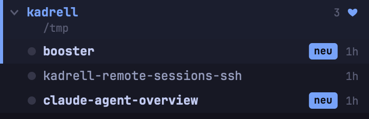
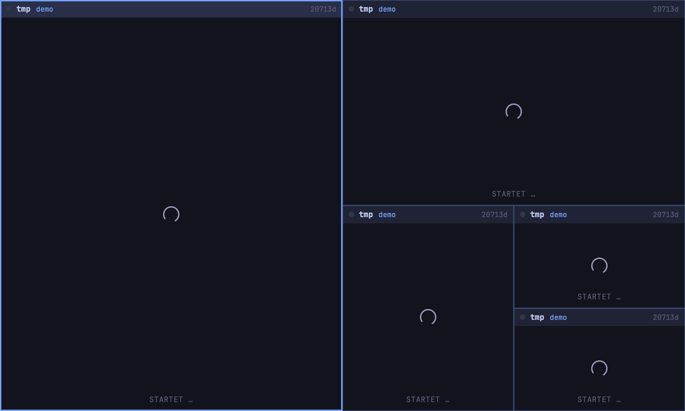
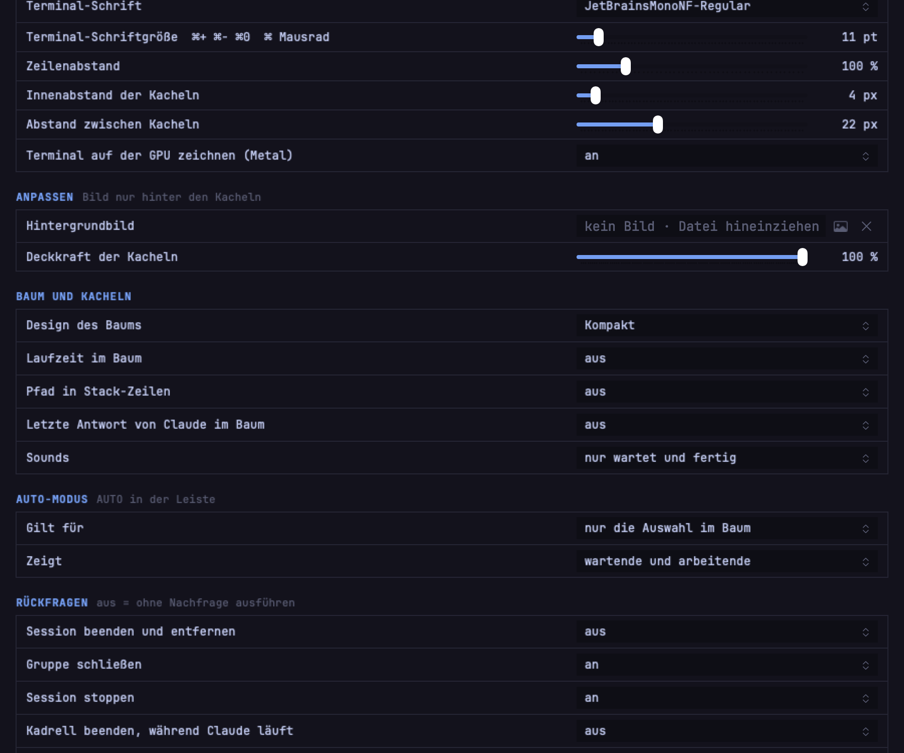

# Kadrell

Native macOS-App (AppKit, Swift 6) für Claude-Code-Sessions: links ein Baum Gruppe › Session, rechts die
ausgewählten Sessions als Terminals im Grid oder als Stack (i3-Akkordeon).
Kein `claude --bg`: jede Kachel startet Claude selbst als Kindprozess in einer SwiftTerm-PTY, neue Sessions mit
`claude --session-id <uuid>`, bekannte mit `claude --resume <sessionId>`. Die Liste liegt in
`~/Library/Application Support/de.malura.kadrell/sessions.json`. Beim Beenden von Kadrell enden die Prozesse,
beim nächsten Start setzt `--resume` die angezeigten fort; ausgeblendete starten erst beim Anklicken. Status, Titel
und aktuelle sessionId pollt die App über `claude agents --json --all`, zugeordnet über die pid des eigenen Prozesses.
Laufende `claude --bg`-Sessions bietet sie beim Start zur Übernahme an (`claude stop`, dann `--resume`).

```bash
/opt/homebrew/bin/xcodegen generate   # kopiert app/Package.resolved (gepinnte Paketversionen) ins Projekt
xcodebuild -project Kadrell.xcodeproj -scheme Kadrell -configuration Debug -derivedDataPath build \
  -skipPackagePluginValidation -skipMacroValidation build
open build/Build/Products/Debug/Kadrell.app
```

Profile: `open -n Kadrell.app --args --profile <name>` startet eine weitere Instanz mit eigenen Sessions, Gruppen,
Einstellungen und eigenem Socket (`~/Library/Application Support/de.malura.kadrell/profiles/<name>/`). Ohne Namen
gilt das Standardprofil am bisherigen Ort. `--profile tmp` ist ein Wegwerfprofil im Temp-Ordner, das beim Beenden
verschwindet (auch im Menü: „Neue Instanz mit temporärem Profil“). Jedes Profil läuft höchstens einmal.

Layouts (Symbol links in der Leiste, ⌘L reihum): Grid, Haupt + Spalte, Spirale (bspwm), Frei (i3), Scrollen (niri), Stack. Jedes Layout ist eine
Vorlage aus Feldern, die Terminals füllen sie in Baumreihenfolge. Trennlinien lassen sich ziehen (Doppelklick verteilt
gleich) oder per ⌃⌥-Pfeil um 5 % verschieben, die Verhältnisse gehören der Vorlage, nicht den Sessions. Im Grid legt
‹ SP › in der Leiste die Spaltenzahl fest. Frei: jede Kachel teilt das Feld der vorigen rechts oder unten, gesetzt per
⌃⌥⇧→ / ⌃⌥⇧↓ an der Fokus-Kachel oder über „TEILT“ in der Leiste (ohne Vorgabe entlang der längeren Seite); die
Richtungen gehören der Position, nicht der Session. Scrollen: Spalten mit fester Breite (⌃⌥←/→ schaltet ⅓ ½ ⅔),
die Fläche scrollt seitlich (Wischen, ⇧ + Mausrad), die Fokus-Kachel rückt von selbst ins Bild.

Bedienung: Klick im Baum zeigt nur diese Session, ⌘-Klick nimmt sie dazu oder weg, ⇧-Klick markiert den
Bereich seit dem letzten Klick, Klick auf eine Gruppe zeigt alle ihre Sessions. Ziehen im Baum oder an der Titelzeile
einer Kachel sortiert um, beide Seiten zeigen dieselbe Reihenfolge (Kachel auf eine fremde Gruppe zieht die ganze Gruppe mit).
⌘B blendet den Baum aus, ⌘N neue Session (Suchfeld über Gruppen, benutzte Ordner und Git-Repos unter dem Projektordner; `~/d/p/kad` kürzt Pfade ab, ⌘O Finder, Ordner aus dem Finder in Dialog oder Baum ziehen), ⌘⏎ neue Session im Ordner der fokussierten, ⌘T Terminal ohne Claude im selben Ordner, ⌘P Suche
(`>` Kommandos, `/` Text in allen laufenden Terminals, direkt per ⌘⇧F), ⌘F Suchleiste im fokussierten Terminal (⌘G / ⌘⇧G weiter), ⌘W beendet die fokussierte Session. Der rote Knopf versteckt nur das Fenster, Kadrell und alle Sessions laufen weiter; das Menüleisten-Icon (Kurzstatus wartend/arbeitend) oder ein Klick aufs Dock-Icon holen es zurück. ⌘⇧T öffnet ein weiteres Fenster mit denselben Sessions, aber eigener Auswahl, eigenem Layout und Fokus (z. B. für einen zweiten Monitor); ein Terminal hängt nur in einem Fenster, die Kachel im anderen zeigt „IN ANDEREM FENSTER“ und holt es per Klick oder Fokus. Zusatzfenster schließen (⌘⇧W, roter Knopf) beendet keine Session, offene Fenster kommen beim Neustart wieder. F1 zeigt die Hilfe, beim ersten Start automatisch.

Belegbare Kürzel (⌘, Einstellungen, Defaults wie in der tmux-Config): ⌥-Pfeile Fokus, ⌥⇧-Pfeile Kachel
tauschen, ⌥1…⌥9 Kachel direkt, ⌥N/⌥P nächste/vorige, ⌥J/⌥K Vorschau: blättert durch den Baum und zeigt die Session allein, ohne die Auswahl anzufassen (⏎ übernimmt, Esc zurück), ⌥⇥ zuletzt fokussierte, ⌥I Sync (Tippen und ⌘V gehen an alle offenen Kacheln, rotes Badge „SYNC“ in der Leiste, auch per Klick), ⌥Z Zoom (Fokus-Kachel allein,
Badge „ZOOM“ in der Leiste und „Z“ in der Titelzeile), ⌥E Ordner der Fokus-Session im externen Editor (Kommando in den Einstellungen, z. B. `code`),
F2 oder Stift an Kachel/Baum-Zeile benennt die Session um (eigener Name geht immer vor dem Titel von Claude Code, leer = zurück),
⌘L Grid ↔ Stack, ⌘Esc Kachel schließen
(Esc selbst geht an Claude Code). ⌘1 gibt dem Baum die Tastatur, ↑↓ zeigt dann die nächste Session rechts, ohne
dass Claude die Tasten bekommt; ⌘2 gibt die Tastatur an die fokussierte Kachel zurück (ohne offene Kachel: erste Session).

Darstellung (⌘, Einstellungen): Design des Baums (Klassisch, Getönte Gruppen, Kompakt; je ein `SidebarRenderer`
unter `Kadrell/Sidebar/`), Laufzeit im Baum an/aus, UI-Größe 90 bis 130 % für Baum, Leiste, Kacheln und Dialoge, Terminal-Schrift
(alle installierten Monospace-Fonts), Schriftgröße, Zeilenabstand und Innenabstand der Terminals.
⌘+ / ⌘- / ⌘0 ändern die Terminal-Schriftgröße direkt, für alle Terminals.

Hooks (wie tmux `set-hook`): ausführbare Skripte unter `~/.config/kadrell/hooks/`, Name = Ereignis.
`session-new` (Session angelegt oder übernommen), `session-focus` (andere Session fokussiert, auch beim Start),
`session-remove` (Session entfernt). Aufruf im Session-Ordner ohne Warten mit `$1` Ordner, `$2` sessionId von
Claude Code, `$3` Titel; Umgebung wie Claude (Login-Shell) plus `KADRELL_EVENT`, `KADRELL_CWD`,
`KADRELL_SESSION_ID`, `KADRELL_SESSION_KEY`, `KADRELL_TITLE`, `KADRELL_BRANCH`. Fehlt das Skript, passiert nichts.
Skripte (und der Ordner), die nicht dem eigenen Benutzer gehören oder für Gruppe/andere beschreibbar sind, laufen nicht.

Fernsteuerung (wie das `tmux`-Kommando): Menü Kadrell › „Kommandozeilen-Tool installieren …“ legt
`~/.local/bin/kadrell` als Symlink auf das App-Binary an. `kadrell <befehl>` spricht über den Unix-Socket
`~/Library/Application Support/de.malura.kadrell/kadrell.sock` (0600) mit der laufenden App und startet sie, falls
sie nicht läuft. Befehle: `ls [--json]`, `new-group`, `new [-t gruppe] [-c ordner] [-d] [prompt]`, `select`, `layout`,
`zoom`, `rename`, `move`, `set-group`, `stop`, `resume`, `kill`, `kill-group`, `send [-k]`, `capture [--all]`, alles in
`kadrell help`. Ziele per `-t` (Key-Anfang, Titel, Gruppenname); ohne `-t` gilt die Session, in der das Kommando
läuft: jede Kachel hat `KADRELL_SESSION_KEY`, `KADRELL_SOCKET` und `KADRELL` (Pfad zum Binary) in der Umgebung.
Per CLI angelegte Gruppen sind Favoriten, sonst räumt der Abgleich sie leer wieder weg. Rückfragen entfallen.
Welche Kachel aufruft, bestimmt die App selbst über die pid am Socket (`LOCAL_PEERPID`) und den Prozessbaum bzw. die
Terminal-Session der Kacheln, nicht über `KADRELL_SESSION_KEY`. Einstellung „Sessions dürfen andere Sessions steuern“
(Default an): aus, dürfen Aufrufe aus einer Kachel nur Sessions der eigenen Gruppe und diese Gruppe selbst ansprechen (`send`,
`capture`, `stop`, `kill` …); `ls`, `select`, `layout` und `new` bleiben frei, Aufrufe von außerhalb sind nie eingeschränkt.
Das ist Schadensbegrenzung gegen Prompt Injection, keine harte Grenze: alles läuft als derselbe Benutzer.

tmux-Sessions importieren: `tools/tmux-dump.py dump -o dump.json` sammelt alle laufenden Claude-Sessions aus
tmux-Panes (Baum Session/Window/Pane) als JSON, `tools/tmux-dump.py import dump.json` startet sie per
`claude --bg --resume` als Hintergrund-Sessions (läuft die Original-Session noch, macht das eine Kopie statt sie
anzufassen) und legt je tmux-Session eine Gruppe in `groups.json` an. Kadrell muss dabei beendet sein, sonst
überschreibt der Import dessen `groups.json` unter der laufenden App weg. `--dry-run` zeigt nur, was passieren würde.
Der Leerzustand zählt separat, wie viele Claude-Sessions gerade interaktiv in anderen Terminals laufen, und
verweist auf dieses Skript.

Wissensgraph (graphify): `graphify-out/` enthält einen mit [graphify](https://github.com/safishamsi/graphify)
(`uv tool install graphifyy`) gebauten Code-Graph über `app/Kadrell`, nicht eingecheckt (`.gitignore`),
Ausschlüsse zusätzlicher Pfade (Reports, Bilder) in `.graphifyignore`. `graphify hook install` hat post-commit
und post-checkout eingerichtet (rebuildet Code-Only im Hintergrund, kein API-Key nötig, Log unter
`graphify-out/graphify-hook.log`). Für post-merge (fehlt in `graphify hook install`, da `git merge`/`git pull`
kein `post-commit` auslösen) `tools/graphify-hook.sh` einmalig anhängen:
```bash
hook=".git/hooks/post-merge"
[ -f "$hook" ] || printf '#!/bin/sh\n' > "$hook"
grep -q 'tools/graphify-hook.sh' "$hook" || printf '\n"$(git rev-parse --show-toplevel)"/tools/graphify-hook.sh "$@" &\n' >> "$hook"
chmod +x "$hook"
```
Beide Wege überspringen linked worktrees (`.claude/worktrees/`), laufen nie blockierend und scheitern nie am
fehlenden `graphify`. Abfragen: `graphify query "<Frage>"` gegen `graphify-out/graph.json`.

## Warum Kadrell statt Terminal-Tabs oder tmux allein

- **Startet und hält Claude selbst.** Kein `claude --bg`, kein separates Attach-Kommando: jede Kachel ist eine echte PTY mit einem Claude-Kindprozess, neue Sessions per `--session-id`, bekannte per `--resume`. Beendet sich Kadrell, enden die Prozesse mit; beim nächsten Start läuft jede angezeigte Session mit ihrem Verlauf weiter.
- **Baum mit Gruppen statt flacher Tab-Leiste.** Gruppe = Projektordner, darunter ihre Sessions mit Status, Laufzeit und Marke „neu“ für ungesehen fertige oder wartende Sessions. Bei fünf, acht, zwölf offenen Sessions bleibt sichtbar, wer arbeitet, wer wartet und wer fertig ist, ohne jede Kachel einzeln durchzuklicken.

  

- **Kachel-Layouts wie i3/bspwm statt starrem Grid.** Neben Grid und Stack gibt es Haupt + Spalte und Spirale (jede Kachel halbiert den Rest, wie bspwm), mit ziehbaren Trennlinien oder ⌃⌥-Pfeiltasten. Die Aufteilung gehört zum Layout, nicht zur einzelnen Session.

  

- **tmux-Kürzel statt neuer Bedienung.** Fokus, Kachel tauschen, Zoom, Sync, Rename: die Standardbelegung folgt tmux, jedes Kürzel lässt sich umbelegen. Wer tmux im Muskelgedächtnis hat, muss nichts Neues lernen.
- **Remote genauso wie lokal.** ⌘⇧N verbindet per ssh mit einem Host aus der ssh-Konfiguration und hängt sich an dessen tmux, in derselben Oberfläche wie lokale Sessions.
- **Profile statt einer Instanz für alles.** `--profile <name>` startet eine weitere Kadrell-Instanz mit eigenen Sessions, Gruppen und Einstellungen, `--profile tmp` ein Wegwerfprofil zum Testen. Mehrere Kadrell-Instanzen laufen nebeneinander, ohne sich zu stören.
- **Anpassbare Darstellung statt fixer Optik.** Terminal-Schrift, Schriftgröße, Zeilenabstand, Innen- und Außenabstand der Kacheln, UI-Größe, Hintergrundbild mit einstellbarer Deckkraft.

  

- **Alles in einem Fenster.** Kein zweites Tool für Status, keine separate Übersicht: Baum und Terminals sitzen im selben Fenster, das Menüleisten-Icon holt es bei Bedarf zurück.

Details, verifizierte CLI-Fakten und Abweichungen vom Brief: `../docs/kadrell-verifikation.md`.
